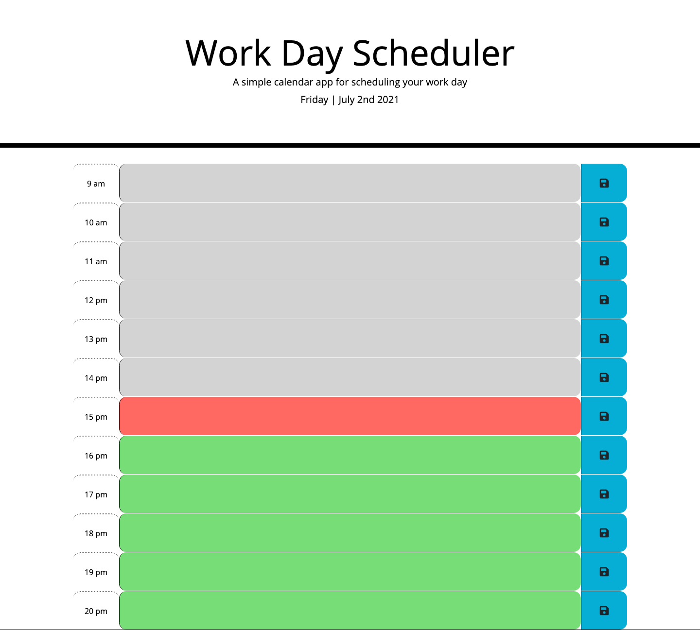

# Challenge 5 Work Day Scheduler

[Link to deployed application](https://thomasbewell.github.io/challenge5-scheduler/)

## Purpose

This is the 5th challenge assignment for my coding boot camp. For it I wrote the fucntionality for a work day schedluer applicaiton using JavaScript (HTML and CSS were provided).

## Screenshot

